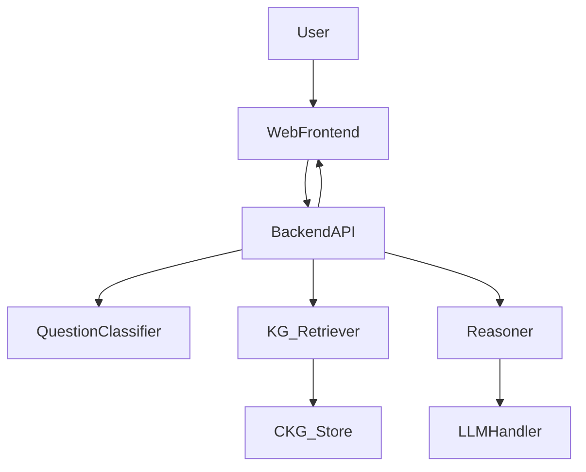

# Kiến trúc tích hợp CKG vào chatbot web riêng (demo khoá luận)

## 1) Mục tiêu kiến trúc
- Tách bạch rõ:
  - **Tri thức nhân quả** (CKG) → lưu & truy xuất
  - **Suy luận** (retrieval + chain selection + condition-check) → tạo “explanation plan”
  - **Sinh ngôn ngữ** (LLM) → viết câu trả lời dựa trên plan + evidence
- Dễ demo trên web riêng, không đụng vào web của giảng viên.

## 2) Sơ đồ tổng quan

## 3) Thành phần & trách nhiệm

### 3.1. `CKG_Store`
- Nguồn gốc: `causal/causal_knowledge/data/merged_knowledge_graph.json`
- Giai đoạn 1: đọc JSON vào bộ nhớ (NetworkX/đồ thị nội bộ)
- Giai đoạn 2 (tuỳ chọn): xuất/đồng bộ Neo4j để query phức tạp

### 3.2. `QuestionClassifier`
- Nhận `question` → trả:
  - `intent`: causal_explain / what_if / forecast / general
  - `entities`: node candidates (ví dụ `pm25`, `relative_humidity`, `cold_surge`)
  - `time_context`: mùa/đêm/ngày (nếu có)
- Ưu tiên rule-based + dictionary; LLM chỉ dùng khi cần (để giảm hallucination)

### 3.3. `KG_Retriever`
- Input: entities + intent
- Output: `candidate_relationships` và `candidate_paths` (2–4 bước tới `pm25`)
- Rule: ưu tiên `confidence=HIGH`, `tier_1/2`

### 3.4. `Reasoner`
- Input: candidate paths + (tuỳ chọn) snapshot dữ liệu hiện tại
- Output: `selected_chains`, `supporting_factors`, `uncertainties`
- Giai đoạn chưa có pipeline theo giờ:
  - Chỉ condition-check được một phần (mùa/giờ theo mô tả)
  - Các điều kiện chưa kiểm tra được → đẩy vào `uncertainties`

### 3.5. `LLMHandler`
- Input: explanation plan + evidence
- Output: câu trả lời tiếng Việt có cấu trúc, trích dẫn gọn nguồn
- Ràng buộc: chỉ dùng thông tin từ plan/evidence (theo `REASONING_GUIDE.md`)

## 4) Luồng xử lý cho câu hỏi “Tại sao PM2.5 cao?”

1) `QuestionClassifier` nhận diện causal question, entity: `pm25` + (ngữ cảnh mùa đông nếu có)  
2) `KG_Retriever` lấy subgraph quanh `pm25` và seasonal/meteorology  
3) `Reasoner` chọn 1–3 chains (ví dụ: inversion/PBLH thấp/cold surge transport) + ghi uncertainties  
4) `LLMHandler` viết giải thích dạng “nguyên nhân chính/yếu tố bổ trợ/điều kiện/nguồn”  

## 5) Tại sao kiến trúc này hợp lý cho khoá luận
- Phần đóng góp rõ: **formal hoá tri thức nhân quả** + **thiết kế suy luận grounded**.
- Không bị “kẹt” vào pipeline dữ liệu theo giờ (có thể bổ sung dần mà không thay kiến trúc).
- Demo được cả offline (notebook) lẫn web riêng.

